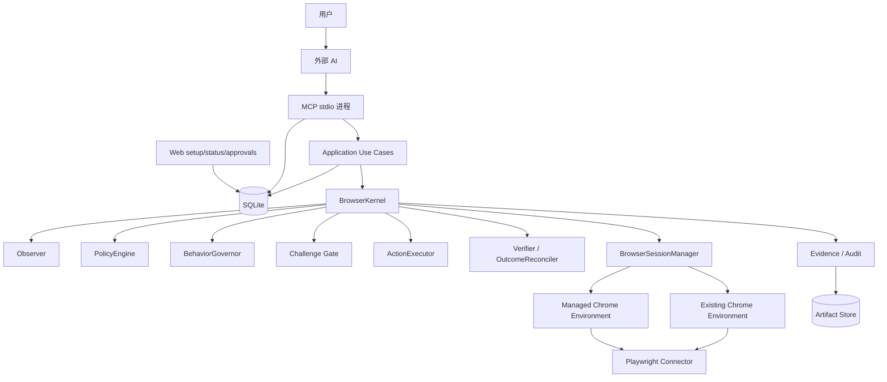

# WebAuto 最终方案

> 文档状态：Final / Canonical，项目唯一方案与执行依据  
> 版本：v3.3 Final  
> 更新日期：2026-08-27  
> 实施资源：1 名开发者  
> 当前交付：本地单用户、外部 AI 经 MCP 使用真实 Chrome  
> 后续兼容：第三方浏览器环境、完整策略中心、Site Skill 扩展  
> 合规边界：仅用于用户授权的正常 Web 操作；不破解验证码、不伪造业务响应、不绕过访问控制、不承诺规避站点风控

本文是 WebAuto 唯一有效方案与执行计划。此前位于 docs/01-项目方案、docs/07-实施方案 的项目方案、实施方案和任务清单，以及旧 Browser Use 设计说明，均由本文替代；§16 的 B0—B4 任务拆分是唯一执行依据。实施进度和测试报告仍作为历史证据保留，但不得作为新的架构或排期依据。

## 0. 最终结论

WebAuto 定位为“外部 AI 可调用的受治理真实浏览器执行服务”，而不是再开发一套内置聊天 Agent。

最终决策：

1. 外部 AI 负责目标理解、规划和动态调整；WebAuto 负责会话、动作、约束、审批、验证、证据和审计。
2. 本地单用户不新建独立 Daemon；stdio MCP 进程即运行时，Web 与 MCP 通过标准库 `sqlite3` 文件跨进程协调所有权、审批和预算。
3. 所有页面动作必须经过同一个 BrowserKernel（`McpBrowserRuntime` 迁入的唯一执行门面）。
4. v3.3 是一个约 15—22 个工作日可发布的 MVP，不把完整目标架构一次性交付。
5. v3.3 只支持 Managed Chrome 和 Existing Chrome CDP，不接第三方指纹/Profile 浏览器。
6. Browser Use 从 v3.3 正式支持范围移除；旧配置只返回迁移错误，不维护可执行兼容路径。
7. v3.3 使用版本化基础策略和受限配置页；完整 Policy Center 延后到 v3.4。
8. 约束由系统强制执行，智能体不能改策略、换身份、轮换代理、处理验证码或绕过拒绝。
9. 非幂等写入只有在定义业务事实、Verifier 和 OutcomeReconciler 后才可自动执行；否则只能准备并交给用户。
10. 存储用标准库 `sqlite3`，只建 Lease、ActionAttempt、Approval、Budget、Audit 五类安全状态；不建 Outbox 和通用 Repository/UoW，也不强制 PostgreSQL/Redis。
11. v3.3 先把工具请求做稳定、可解释、可恢复；Provider 插件、Skill Overlay 和完整诊断平台不阻塞当前发布。

## 1. 版本边界与 MVP 切片

### 1.1 版本路线

| 版本 | 目标 | 必须交付 | 不阻塞本版本的内容 |
|---|---|---|---|
| v3.3 MVP | 让外部 AI 稳定使用一个受治理本地浏览器 | stdio MCP + sqlite3 跨进程协调、统一 BrowserKernel、结构化结果、基础治理、Managed/CDP、最小 SQLite、Chrome E2E | 完整策略编辑器、第三方 Provider、Browser Use、Daemon、远程、多租户、自动学习 |
| v3.4 | 增强策略和站点能力 | 完整 Policy Center、Policy Overlay、Site Skill SDK、语义写入、Replay/诊断、购物/咸鱼首批技能 | 第三方浏览器和远程节点 |
| v3.5 | 扩展浏览器环境和部署形态 | Provider 插件、客观门槛触发的单供应商 POC、可选 PostgreSQL/远程节点 | 多租户 SaaS、无人值守高风险写入 |

v3.4、v3.5 是路线图，不属于 v3.3 Definition of Done。没有完成后续版本，不影响 v3.3 被正确发布和日常使用。

### 1.2 v3.3 MVP 必须完成

- stdio MCP 进程即运行时，Web 与 MCP 通过 sqlite3 跨进程协调；不再创建进程内权威 `_BROWSER_RUNTIMES`；
- Managed Chrome 和 Existing Chrome CDP 共享统一 BrowserKernel（`McpBrowserRuntime` 迁入的唯一执行门面）；
- BrowserKernel 完成 `observe -> policy/gate -> prepare -> dispatch -> verify -> record`；
- 快照 ref、页面版本、结构化 `OperationOutcome`、Error Catalog；
- 域名/网络边界、组合键限速、重试预算、Challenge Freeze、人工接管；
- 低风险读取与表单准备；
- L3/L4 或无法反查的写动作只生成预览，不由 Agent 自动提交；
- 本地确定性测试站点的 `builtin_test.listing.publish` 具备 OutcomeReconciler，并完成闭环测试；
- 用标准库 `sqlite3` 持久化 Lease、ActionAttempt、Approval、Budget、Audit 五类安全状态；不建 Outbox 和通用 Repository/UoW；
- `/setup` 提供 Profile、允许域名、基础速率和审批配置；
- Managed Chrome 自动 E2E 与 Existing Chrome 监督式冒烟至少各跑通一条。

### 1.3 v3.3 明确不做

- Browser Use 运行适配器和依赖；
- 第三方指纹/Profile 浏览器；
- Provider Entry Point 插件市场；
- 通用 Policy YAML 编辑器、策略模拟、灰度发布和 Agent 政策提案；
- Skill Overlay 自动生成与发布；
- 购物、咸鱼完整产品闭环；
- 远程浏览器、多节点 Worker、PostgreSQL/Redis 强依赖；
- 自动支付、退款、删除、批量发布、批量改价；
- 任意 Shell、任意 JavaScript、原始 CDP 或整个文件系统工具。

## 2. 产品定义与用户体验

### 2.1 产品定义

> 用户在自己选择的 AI 客户端中下达 Web 目标；AI 经 WebAuto MCP 观察和操作授权浏览器；WebAuto 对每个动作强制检查身份、域名、风险、速率、页面版本和审批，并用页面证据验证结果。

### 2.2 典型请求

- 搜索多个网站，整理带来源的结果；
- 在已登录页面读取账户、订单或后台信息；
- 填写网页表单、选择选项、上传授权文件，提交前交用户确认；
- 下载文件到隔离目录并返回来源、哈希和保存位置；
- 遇到登录、验证码、扫码或设备确认时由用户接管，归还后继续；
- 后续通过 Site Skill 完成购物比较、咨询草稿、发布预览等领域操作。

### 2.3 完成语义

“页面点击成功”不等于任务成功：

- 只读结果必须包含来源和时点；
- 页面动作必须重新观察；
- 写入必须有提交前 Diff 和提交后 Verifier；
- 无法确认结果时返回 `UNCERTAIN_COMMIT`；
- 用户接管后必须重新建立页面版本；
- 任何失败都要返回原因、是否可重试和系统允许的下一步。

### 2.4 非目标

- 不开发浏览器内核；
- 不以规避网站风控为产品指标；
- 不保证所有网站、账号、网络和风控条件都能无人值守；
- 不自动破解验证码或篡改网页业务响应；
- 不让模型接触 Cookie、密码、Token、Provider Endpoint 和代理凭据；
- 不在核心中硬编码完整购物、发布或店铺经营流程。

## 3. 当前基线与必须先处理的问题

### 3.1 可复用能力

- Playwright/CDP、Managed Chrome、Existing Chrome Provider；
- 页面 DOM/A11y/截图观察；
- 导航、点击、输入、选择、上传、下载和抽取原子动作；
- Profile、Approval、Artifact、Verifier、RateLimiter、ChallengeDetector；
- Goal/Step 等领域契约（Run 契约不迁移，v3.3 用会话/Attempt 替代）；
- 现有 EventReplay、SkillCandidateBuilder 源码保留到 v3.4，不计入 v3.3 交付；
- 现有 PostgreSQL Repository/迁移和本地 JSON Store 只作为迁移输入；仓库当前没有可直接复用的 SQLite Schema；
- `/setup`、Control API、MCP 和现有测试。

### 3.2 当前阻断

| 阻断 | 影响 | v3.3 处置 |
|---|---|---|
| 三条执行路径并存 | 安全和结果语义不一致 | 全部迁入 BrowserKernel |
| MCP 使用进程内浏览器单例 | 多客户端争用 Profile | sqlite3 跨进程 Lease + fencing |
| ApplicationService 大量内存状态 | 崩溃恢复不足 | 最小安全状态表（Lease/ActionAttempt/Approval/Budget/Audit） |
| 全局 JSON 状态快照 | 并发和迁移困难 | 仅保留迁移读取，不再作为正式写模型 |
| MCP 工具和分发重复维护 | Schema 漂移 | 单一 Schema 生成 |
| 错误转成普通字符串 | Agent 无法恢复 | Error Catalog + OperationOutcome |
| 风险依赖元素文字关键词 | 未知交互被低估 | Unknown 默认 L2 |
| RateLimiter 键仅有 Profile+Site | 多账号/Provider/网络预算冲突 | 完整身份键 + 跨 Provider 的账号安全预算 |
| Challenge 执行位置不清 | 可能先动作后阻断 | Observer + Pre-dispatch Gate 双阶段 |
| Browser Use 仍是可选依赖 | 双执行栈维护 | v3.3 删除支持 |
| Dashboard/Settings 仍暴露 Browser Use | 用户仍可选择已退役后端 | 删除 UI 选项，更新接口拒绝新值，旧值只迁移告警 |
| 现有 SQL 是 PostgreSQL 方言 | 无法作为 SQLite v3.3 迁移执行 | 新建 SQLite 专用迁移目录和物理表映射 |
| 缺少可观测性模块 | 无法生成发布基线 | 结构化 MetricEvent + SQLite 聚合报告 |
| Python 版本声明与代码不一致 | Python 3.10 收集失败 | 最低版本改为 3.11 |
| Chrome E2E 尚无基线 | 无法声明可靠率 | Phase 0 先跑通纵向用例 |
| v3 源码/测试未完整跟踪 | 无法复现发布 | Phase 0 纳入 Git |

### 3.3 已知测试基线

- WSL 项目环境：`232 passed, 2 failed, 4 skipped`；
- 两个 Dashboard 断言待修复；
- Chrome E2E 因缺少可执行文件而跳过；
- Ruff 尚未在当前项目环境形成可执行证据。

这些是起点，不是 v3.3 完成证据。

## 4. 总体架构



### 4.1 进程职责

| 进程/模块 | 负责 | 不负责 |
|---|---|---|
| 外部 AI | 目标理解、动态规划、选择下一步 | 修改策略、控制 Provider、决定跳过 Challenge |
| MCP stdio 进程 | Tool Schema、鉴权、转发、结果映射、Kernel 调用 | 与 Web 之间靠 sqlite3 协调，不独占浏览器权威状态 |
| BrowserKernel | 唯一页面动作、验证和审计主链 | 配置发布和供应商秘密管理 |
| Browser Environment | 启动/连接浏览器环境 | 页面点击、风险和业务验证 |
| Web 控制面 | 安装配置、基础策略、状态和审批 | 任务规划和模型对话 |
| SQLite | Lease、ActionAttempt、Approval、Budget、Audit 跨进程协调 | 通用 Repository/UoW、Outbox |

### 4.2 依赖方向

```text
domain <- application <- runtime/adapters
domain <- storage implementations
```

- `domain` 不依赖 Playwright、FastAPI、MCP 和数据库；
- `runtime`、`storage` 不导入 `application.settings/state`；
- Adapter 只调用 Application Use Case；
- Browser/Provider 不可直接写 Approval、Policy 和会话状态；
- 任何可写 Page/Context 只在 BrowserKernel 内部可见。

## 5. v3.3 模块边界

| 模块 | MVP 职责 | 核心输出 |
|---|---|---|
| SessionManager | Profile Lease、ControlOwner、会话恢复 | `BrowserSessionHandle` |
| Observer | 页面、ref、业务事实、Challenge 信号 | `PageObservation` |
| PolicyEngine | 系统硬约束、基础分层策略、风险 | `PolicyDecision` |
| BehaviorGovernor | 限速、并发、预算、冷却、身份一致性 | Permit/Block |
| ChallengeObserver/Gate | 持续检测并在动作前冻结 | Session Challenge State |
| NetworkGuard | 协议、DNS、私网、重定向、下载边界 | Network Decision |
| ActionExecutor | 执行已授权原子动作 | Dispatch Result |
| Verifier | 检查预期页面效果 | Verification Result |
| OutcomeReconciler | 非幂等结果的业务反查 | Reconcile Result |
| Evidence/Audit | 脱敏证据和决策链 | Evidence Reference |
| Storage | sqlite3 安全状态表（Lease/ActionAttempt/Approval/Budget/Audit） | Commit Event |

## 6. 统一结果协议与工具面

### 6.1 领域级 OperationOutcome

MCP 和 HTTP 不共享完全相同的响应外形，但必须共享同一个领域结果：

```python
class OperationOutcome(BaseModel):
    status: Literal["succeeded", "blocked", "waiting", "failed", "uncertain"]
    code: str
    category: str
    message: str
    retryable: bool
    retry_policy: RetryPolicy | None
    observed: dict[str, Any]
    next_actions: list[str]
    policy_decision_id: str | None
    policy_version: str | None
    policy_explanation: dict[str, Any] | None
    evidence_ids: list[str]
```

传输映射：

| 入口 | 对外形式 | 必须保持一致的语义 |
|---|---|---|
| MCP | `ToolResultEnvelope` | status/code/category/retry/next actions/decision/evidence |
| HTTP 成功 | `2xx` + `OperationOutcome` JSON | 同一 status/code/category/decision/evidence |
| HTTP 失败 | `application/problem+json` | 同一 code/category/retry/next actions/decision/evidence |
| CLI | 人类摘要 + 可选 JSON | 同一 code 和退出码映射 |

HTTP 失败必须符合 Problem Details；标准字段与扩展字段冻结为：

```json
{
  "type": "urn:webauto:problem:STALE_REF",
  "title": "Stale page reference",
  "status": 409,
  "detail": "脱敏的人类可读说明",
  "instance": "urn:webauto:request:<opaque-request-id>",
  "code": "STALE_REF",
  "category": "page_state",
  "outcome_status": "failed",
  "retryable": true,
  "retry_policy": {"mode": "reobserve_once", "max_attempts": 1},
  "next_actions": ["browser_snapshot", "cancel"],
  "policy_decision_id": null,
  "policy_version": null,
  "policy_explanation": null,
  "evidence_ids": []
}
```

映射规则：

- `type/title/status` 来自 Error Catalog，调用者不能临时改写；
- `detail` 来自 `OperationOutcome.message` 的脱敏版本；
- `instance` 只包含不透明 Request ID，不放会话、Approval、账号或业务摘要；
- `code/category/outcome_status/retryable/retry_policy/next_actions/policy_decision_id/policy_version/policy_explanation/evidence_ids` 是固定扩展字段；
- 未知异常只能映射 `INTERNAL_ERROR`，不能把 Python 异常文本直接返回；
- HTTP Adapter、OpenAPI 示例和 MCP Envelope 由同一 Catalog/领域模型生成契约测试。

“旁路”的定义是没有经过相同 Use Case、BrowserKernel、Policy 和 Storage，而不是响应 JSON 是否逐字相同。任何能够触发页面动作的 HTTP API 必须调用同一个 BrowserKernel；管理 API 不进入 Agent MCP 工具面。

### 6.2 v3.3 默认 MCP 工具

默认工具固定为 22 个：

| 分组 | 工具 |
|---|---|
| 会话 | `browser_open`、`browser_status`、`browser_close` |
| 观察 | `browser_snapshot`、`browser_screenshot` |
| 页面动作 | `browser_navigate`、`browser_click`、`browser_type`、`browser_select`、`browser_scroll`、`browser_wait` |
| 标签 | `browser_tabs`、`browser_tab_open`、`browser_tab_switch`、`browser_tab_close` |
| 文件 | `file_upload`、`file_list` |
| 受治理写入 | `governed_action_prepare`、`governed_action_get`、`governed_action_execute` |
| 协同 | `human_takeover`、`human_return_control` |

约束：

- Pydantic Schema 是工具定义、分发器和文档的唯一来源；
- 不新增 `browser_extract`、`browser_file`、`file_authorize`、`approval_status` 等凑数工具：`browser_snapshot` 已返回文本，文件 SHA-256 与作用域在 `governed_action_prepare` 内绑定；
- 旧工具只在一个过渡小版本中映射到新 Use Case，并返回 `deprecation`；
- 不向模型暴露 settings、Provider、Policy Publish、Secret 和诊断管理工具；
- 垂直能力以后通过 Site Skill Capability 发现，不扩张默认工具面。

### 6.3 Error Catalog

Error Catalog 是代码、MCP Schema、HTTP 文档和 Agent 指引的单一真源：

| code | category | HTTP | 含义 | 自动重试 | retry policy | 允许的 next actions |
|---|---|---:|---|---:|---|---|
| `INVALID_REQUEST` | request | 422 | Schema、参数或前置条件错误 | 否 | 无 | correct_request/cancel |
| `STALE_REF` | page_state | 409 | 元素引用已过期 | 是 | 重新 snapshot 后最多 1 次 | browser_snapshot/cancel |
| `PAGE_CHANGED` | page_state | 409 | 页面版本变化 | 条件 | 只读或准备阶段可重新观察；写入后不可重发 | browser_snapshot/reprepare |
| `AUTH_REQUIRED` | authorization | 409 | 站点登录、OTP 或设备确认 | 否 | 无自动重试 | human_takeover/cancel |
| `APPROVAL_REQUIRED` | authorization | 409 | 当前动作需要批准 | 否 | 等待一次性批准 | governed_action_get/cancel |
| `APPROVAL_EXPIRED` | authorization | 409 | 批准已过期或对象变化 | 否 | 重新准备并生成新 Diff | governed_action_prepare/cancel |
| `POLICY_DENIED` | governance | 403 | 系统或有效策略拒绝 | 否 | 结果内直接返回脱敏解释，任务不能自行放宽 | cancel |
| `RATE_LIMITED` | governance | 429 | 速率预算耗尽 | 是 | 到 `retry_after` 后最多 1 次 | browser_wait/cancel |
| `CIRCUIT_OPEN` | governance | 429 | 站点/账号安全熔断 | 是 | 冷却结束后重新观察 | browser_wait/human_takeover/cancel |
| `CHALLENGE_DETECTED` | governance | 409 | 验证码或风险校验 | 否 | 禁止自动刷新和重试 | human_takeover/cancel |
| `PROFILE_LEASED` | environment | 409 | Profile 被其他会话占用 | 是 | 等待 Lease 到期，不抢占 | browser_wait/cancel |
| `CONTROL_OWNED_BY_HUMAN` | environment | 409 | 用户正在控制浏览器 | 否 | 等待用户归还 | browser_status/cancel |
| `PROVIDER_UNAVAILABLE` | environment | 503 | 当前浏览器环境不可用 | 条件 | Dispatch 前允许同一会话重连 1 次 | browser_status/cancel |
| `CAPABILITY_UNSUPPORTED` | environment | 422 | 当前环境或语义动作不支持所需能力 | 否 | 不自动换 Provider/Profile | cancel |
| `BACKEND_RETIRED` | environment | 410 | 旧 Browser Use 后端已退役 | 否 | 迁移到标准 MCP/本地浏览器 | browser_status/cancel |
| `NETWORK_BLOCKED` | governance | 403 | 协议、地址或重定向被阻断 | 否 | 任务不能覆盖硬边界 | cancel |
| `DOWNLOAD_BLOCKED` | governance | 403 | 文件类型、大小或来源被阻断 | 否 | 需用户调整配置 | cancel |
| `VERIFICATION_FAILED` | outcome | 409 | 动作效果未满足预期 | 条件 | 只读可重新观察；非幂等写不可重发 | browser_snapshot/governed_action_get/cancel |
| `UNCERTAIN_COMMIT` | outcome | 409 | 无法确认外部写入结果 | 否 | 只读反查或人工处理 | governed_action_get/human_takeover/cancel |
| `INTERNAL_ERROR` | internal | 500 | 非预期内部错误 | 否 | 保存证据，不由 Agent 猜测重试 | cancel/report |

实现要求：

- Catalog 每个 code 都有枚举、低基数 category、默认 HTTP 状态、retryable、最大次数和允许动作；
- Agent 只能选择 `next_actions` 中的动作；
- `next_actions` 里除 22 个 MCP 工具外，`cancel`/`reprepare`/`report`/`correct_request` 是**客户端控制指令**而非新工具；`reconcile` 已并入内核自动反查或 `governed_action_get`，不新增工具；
- 动作的幂等性可以把 Catalog 的“条件重试”进一步收紧，不能放宽；
- 错误消息不包含 Secret、完整 URL Query、Cookie 或页面敏感字段。

## 7. BrowserKernel 与动作协议

### 7.1 强制执行流水线

```text
ResolveSession
 -> Observe + ChallengeObserver
 -> NormalizeAction
 -> EvaluatePolicy
 -> BehaviorGovernor
 -> ChallengeGate
 -> Prepare
 -> Authorize
 -> Persist DISPATCHING
 -> Dispatch
 -> Observe
 -> Verify / Reconcile
 -> Persist Outcome + Evidence + Audit
```

任何阶段拒绝后，后续阶段不得执行。MCP、HTTP、CLI、Site Skill 都不能直接调用 Playwright Page。

### 7.2 页面观察与 ref

`PageObservation` 至少包含：

- session/page/tab、URL、标题、来源和页面类型；
- `page_revision`、观察时间和 ref 失效时间；
- 交互元素的 role/name/type/state/affordance；
- 当前表单值和关键业务事实；
- Challenge、登录、弹窗和网络异常状态；
- Screenshot/DOM/A11y 的 Evidence Reference；
- 页面内容的 `untrusted_web_content` 标记。

ref 只在创建它的 `session_id + page_id + page_revision` 中有效。导航、主框架变化、关键业务事实变化、标签切换或超时后，旧 ref 必须返回 `STALE_REF`，不得模糊匹配相似按钮继续点击。

### 7.3 动作分层

| 层 | 示例 | 编排者 | 执行者 |
|---|---|---|---|
| 观察 | snapshot、extract、screenshot | 外部 AI | BrowserKernel |
| 原子动作 | navigate、click、type、select、scroll | 外部 AI | BrowserKernel |
| 语义动作 | message.send、listing.publish、order.place | Site Skill 提供定义，AI 选择 | BrowserKernel |

核心只提供动作，不固化完整场景。购物、发布等完整流程由外部 AI 组合，稳定网站知识由 Site Skill 提供。

未知交互默认：

- 无法判断是否改变外部状态：`idempotency=unknown`；
- 风险至少 L2；
- 不能直接进入自主写入；
- 图标按钮、无文本按钮、语言变化、`input/change` 即时写入均适用。

### 7.4 ActionAttempt 状态机

```text
RECEIVED
 -> PREPARED
 -> POLICY_CHECKED
 -> WAITING_APPROVAL -> AUTHORIZED
 -> DISPATCHING
 -> VERIFYING
 -> SUCCEEDED / FAILED / UNCERTAIN

分支：
POLICY_BLOCKED / CANCELED
WAITING_HUMAN
  -> SUCCEEDED（用户完成且只读反查确认）
  -> CANCELED（用户拒绝、取消或未完成）
  -> 新 ActionAttempt.RECEIVED（用户要求继续且重新观察后）
```

持久化不能把数据库事务与浏览器外部副作用形成原子事务。因此：

- 进入 `DISPATCHING` 前先持久化动作、对象摘要、策略版本和授权；
- 崩溃恢复时不能依据数据库记录判断网页动作是否已经发生；
- 恢复器必须调用语义动作自己的 OutcomeReconciler；
- 没有 Reconciler 的非幂等动作不得由 Agent 自主执行。
- `WAITING_HUMAN` 是持久暂停状态；归还控制权后旧 Attempt 不回到 `PREPARED`，必须先观察/反查并终结旧 Attempt，继续操作时创建新 Attempt；
- 用户可能在接管期间完成写入，因此归还后不能默认把旧 Attempt 标为失败或重新提交。

### 7.5 OutcomeReconciler

OutcomeReconciler 由 Site Skill/语义动作定义，BrowserKernel 负责调用。Browser Environment Provider 只恢复会话，不负责查询订单、消息或发布结果。

```python
class OutcomeReconciler(Protocol):
    async def reconcile(
        self,
        business_key: BusinessKey,
        prepared_facts: dict[str, Any],
        session: BrowserSessionHandle,
    ) -> ReconcileResult: ...


class ReconcileResult(str, Enum):
    COMMITTED = "committed"
    NOT_COMMITTED_AUTHORITATIVE = "not_committed_authoritative"
    INCONCLUSIVE = "inconclusive"
```

处理规则：

| 结果 | 状态 | 后续 |
|---|---|---|
| COMMITTED | SUCCEEDED | 保存业务标识和证据 |
| NOT_COMMITTED_AUTHORITATIVE | FAILED | 刷新事实后可创建新动作和新审批 |
| INCONCLUSIVE | UNCERTAIN | 禁止重发，交用户或继续只读查询 |

“页面列表暂时没找到”不是权威未提交。只有 Site Skill 明确声明的权威查询、等待窗口和业务键同时满足时，才能返回 `NOT_COMMITTED_AUTHORITATIVE`。

`UNSUPPORTED` 不是运行时反查结果：语义动作没有 Reconciler 或 Environment 明确缺能力时，必须在 Dispatch 前返回 `CAPABILITY_UNSUPPORTED` 并保持 Human Only。已经 Dispatch 后因 Provider 下线、网络失败、会话丢失或查询超时而无法反查，一律返回 `INCONCLUSIVE`，不得降格成“能力不支持”。

OutcomeReconciler 只能执行只读权威查询，并且调用前 Session Challenge State 必须为 `clear`；Challenge 未解除时保持 `WAITING_HUMAN/UNCERTAIN`，不得用反查名义继续自动操作页面。

Approval 在进入 Dispatch 前已经原子消费。`INCONCLUSIVE` 不把原 Approval 回退、续期或改成新状态，原 Approval 保持 `CONSUMED`；后续只读反查按 ActionAttempt 和 BusinessKey 进行，不需要再次消费 Approval。若用户决定重新提交，必须创建新的 ActionAttempt、重新准备事实并申请新的 Approval。

### 7.6 身份和 Provider 切换

- 一个会话固定 `profile_id + account_ref + provider_id + network_identity_ref`；
- 恢复链不得包含自动 `PROVIDER_SWITCH`；
- 当前 Provider 无法恢复时，会话终止或等待用户；
- 如用户选择新 Provider/Profile，必须创建新会话，重新观察、重新准备和重新审批；
- 任何旧 Approval 不可跨身份复用。

## 8. 强制治理

### 8.1 系统硬约束

以下规则不可通过页面或 Agent 关闭：

- CAPTCHA、OTP、扫码、设备确认和风险页自动冻结；
- 非幂等写入不得盲目重试；
- L3/L4 必须审批或人工；
- Challenge 状态下不得自动输入、点击和刷新；
- 用户接管期间 Agent 不得操作；
- Profile/账号/Provider/网络身份不得静默切换；
- 私网、loopback、link-local、云元数据和危险协议默认拒绝；
- Shell、任意 JavaScript、原始 CDP、Cookie、Token 不进模型；
- 任务级约束只能收紧；
- 页面内容不能改变 Policy、工具权限和文件授权。

### 8.2 v3.3 策略层级

```text
System Invariants
  > Global Release
    > Site/Profile Settings
      > Task Tightening
```

- `/setup` 由用户修改允许域名、Profile 映射、基础预算和审批偏好；
- 每次保存生成不可变 `PolicyRelease`，带版本、哈希和 actor；
- BrowserKernel 对每次动作记录实际 Policy Version；
- Task 只能缩小域名、降低预算、提高审批等级；
- v3.3 Agent 只能读取每次结果内嵌的脱敏 Policy Explanation，没有独立的 proposal/update/publish 工具。

### 8.3 v3.4 Policy Overlay 预留契约

Agent 的提议一旦经用户批准，不再是 Task Policy，而是独立的 `PolicyOverlayRelease`：

- 仅作用于 `site + profile + action`；
- `ttl <= 24h`；
- 必须包含 `base_release_id`、Diff、原因、证据和批准人；
- 只能在 System/Global 上限内调整 Site/Profile 字段；
- 不参与 Global Policy 合并，不改变 Global Release；
- 到期自动回到 `base_release_id`；
- 可随时撤销，历史不可删除。

### 8.4 BehaviorGovernor

执行预算键固定为：

```text
site + profile_id + account_ref + provider_id + network_identity_ref
```

另设不能通过换 Provider/网络身份清零的安全作用域：

```text
site + (account_ref or profile_id)
```

- 完整执行键用于并发、速率和身份一致性审计；
- 账号安全作用域持有 403/429/Challenge 冷却、熔断和累计写预算，按 `site + (account_ref or profile_id)` 跨会话保存；
- 用户选择新 Provider 时虽然必须新建会话，但新执行键继承账号安全作用域中更严格的剩余预算和熔断；
- `account_ref` 未知时使用 `profile_id`，不得用空字符串形成所有匿名会话共享或各自清零的预算。

v3.3 初始值：

| 约束 | 默认值 |
|---|---|
| 每 Profile 活跃自动 Session | 1 |
| 同一 Profile 写入并发 | 1 |
| 同站点动作并发 | 1 |
| 单会话自动动作 | 60 |
| 单会话外部写预算 | 0，需用户显式开启参考语义动作 |
| 只读动作自动重试 | 最多 2 次 |
| 已知幂等动作自动重试 | 最多 1 次 |
| 非幂等/未知动作自动重试 | 0 |
| 429 | 遵守 Retry-After，否则冷却 15 分钟 |
| 连续 403 | 2 次后熔断 30 分钟 |
| Challenge | 立即冻结 |

窗口、冷却和熔断状态写入 SQLite，进程重启后不能清零。限速用于减少无意义请求和保护账号，不通过随机轨迹模拟人类。

### 8.5 Challenge 双阶段

Challenge 不是只放在 Dispatch 前或之后，而是一个持续 Observer 加一个强制 Gate：

1. `ChallengeObserver` 监听初始观察、导航响应、页面变化、弹窗和登录状态；
2. 检测到信号后原子写入 Session Challenge State；
3. `ChallengeGate` 在每次 Dispatch 前读取状态并阻断；
4. Dispatch 过程中出现 Challenge 时停止后续动作；
5. Dispatch 后由 Observer 再次观察并更新 Challenge State；Verifier 只判断预期业务效果，不承担 Challenge 分类；
6. 写动作在 Challenge 出现时若外部效果未知，Attempt 进入 `UNCERTAIN`，待接管后通过 Observer + OutcomeReconciler 处理；
7. 用户接管归还后重新观察，只有 Challenge 清除才允许创建新的 ActionAttempt。

### 8.6 NetworkGuard

网络规则分为两类：

- **导航边界**：Agent 可打开的顶层域名、新标签、弹窗和重定向必须匹配授权范围；
- **资源边界**：所有请求类型都阻断私网、loopback、link-local、云元数据、危险协议和不安全下载；正常站点所需的第三方 CDN 不套用顶层域名白名单，但会审计来源。

必须覆盖：

- 导航前 URL 检查；
- DNS 解析后的 IPv4/IPv6；
- 每一跳重定向；
- iframe、fetch/XHR、WebSocket、Service Worker；
- 新标签、下载和外部协议。

DNS rebinding 通过解析前域名校验、连接前地址校验和重定向逐跳校验处理。

## 9. 审批与写操作

### 9.1 Prepare/Execute

```text
governed_action_prepare
 -> 读取当前业务事实
 -> 生成对象摘要、字段 Diff、风险和预期结果
 -> 创建 Approval
 -> 用户批准
 -> governed_action_execute
 -> 再次校验全部绑定
 -> 至多发起一次
 -> Verify/Reconcile
```

Approval 必须绑定：

- run/session/profile/account/provider/network identity；
- action hash、语义动作版本；
- page revision、evidence digest、object digest；
- 价格、SKU、数量、账号、地址引用、文案、文件哈希等业务事实；
- 策略版本和有效期。

任何绑定项变化后旧 Approval 失效。Approval 只能消费一次。`evidence_digest` 是证据内容规范化后的 SHA-256，不等于 `evidence_id`；`evidence_records.digest` 和 Approval 绑定摘要必须一起持久化，执行时按 ID 取证后重新计算并比较摘要。

### 9.2 v3.3 写入边界

- 表单填写和上传可以准备，但最终提交默认由用户；
- generic click 不能被声明成可自动重复的非幂等写入；
- 参考语义写动作必须有 Fixture、本地 E2E、Verifier 和 OutcomeReconciler；
- 支付、删除、退款和批量经营始终为 Human Only；
- v3.3 不以真实电商下单或发布作为发布门禁。

v3.3 唯一发布门禁写动作固定为 `builtin_test.listing.publish`：

- 在本地确定性测试站点运行，不访问真实闲鱼、不产生真实商品；
- 可从现有 `site_skills/builtin/xianyu/fixtures/publish.json` 和 `store.json` 提取并脱敏复制 Fixture，但不直接把现有 xianyu Skill 宣称为已完成；
- Prepare 绑定 `client_request_id + account_ref + title + price + content_digest`；
- Verifier 检查本地发布成功页面；
- OutcomeReconciler 使用 `client_request_id` 查询本地测试站点的已发布商品集合，返回三个 ReconcileResult；
- 真实 `web.listing.publish` 在 v3.4 具备权威“我的商品/草稿”反查后才能进入候选，订单中心不是发布动作的权威反查来源。

## 10. 浏览器环境

### 10.1 v3.3 内置接口

v3.3 只保留两个内置 Environment：

```python
class BrowserEnvironment(Protocol):
    environment_id: str
    async def start(self, request: BrowserStartRequest) -> SessionDescriptor: ...
    async def stop(self, session_id: str) -> None: ...
    async def health(self) -> EnvironmentHealth: ...


class BrowserConnector(Protocol):
    async def connect(self, descriptor: SessionDescriptor) -> NativeBrowserSession: ...


class SessionDescriptor(BaseModel):
    schema_version: Literal["1.0"]
    session_id: str
    environment_id: str
    provider_id: str
    profile_id: str
    account_ref: str | None
    network_identity_ref: str
    connector_kind: Literal["playwright_managed", "playwright_cdp"]
    endpoint_ref: SecretRef | None
    ownership: Literal["webauto", "user"]
    capabilities: frozenset[str]
    created_at: datetime
    expires_at: datetime | None
```

- Managed Chrome：WebAuto 拥有进程和专用 Profile；
- Existing Chrome：用户拥有进程，WebAuto 只连接，不得关闭用户浏览器；
- SessionDescriptor 内的 Endpoint 以 Secret Reference 表示，不进入 MCP、日志和模型。
- Descriptor 只在执行进程内部传递；持久化和诊断输出只能保存/返回脱敏视图，不能序列化 Secret 实值或 Native Handle。
- Contract Test 必须覆盖 Managed/CDP 两种 Descriptor 校验、Capability 传递、Endpoint 不泄露，以及 Existing Chrome 的 `stop` 仅断连不关闭用户进程。

v3.3 不实现 Entry Point 插件发现，只把接口边界和 Contract Test 固定下来。

### 10.2 健康检查

- MCP 进程与 Web 服务启动只做本地配置加载和 Provider 发现，不同步等待浏览器健康；
- 健康检查异步并行执行；
- 本地 Environment 单次超时 2 秒，未来远程 Provider 默认 5 秒；
- 超时或失败标记 `UNKNOWN/DEGRADED`，不阻止 MCP 进程和 `/setup` 启动；
- 只有用户选择该 Environment 创建 Session 时，健康失败才阻止该请求；
- Contract Test 永不在主进程启动阶段自动运行。

### 10.3 Browser Use 退出

v3.3 执行：

- 删除 `browser-use` 可选依赖；
- 删除 Browser Use Adapter 和创建 Browser 的路径；
- 删除/替换 `agent_backend=browser_use` 的可执行配置；
- Dashboard HTML 删除 `browser_use` 选项，Settings 更新接口拒绝新提交该值；
- 启动时如读取到旧配置，迁移读取器将其禁用并返回一次 `BACKEND_RETIRED` 告警和迁移说明，而不是继续创建后端；
- 外部 AI 继续通过标准 MCP 动作规划，不需要内部 Browser Use；
- 未来如重新引入，只能作为独立 Planner 插件，通过同一个 BrowserKernel Contract。

当前仓库没有有效 ADR 文件，不虚构 ADR-001—005 的历史。未来确需拆出独立决策时，从首个真实文件 `ADR-001-<slug>.md` 开始连续编号；Browser Use 旧设计说明不占 ADR 编号。

### 10.4 第三方浏览器 POC 门槛

第三方 Provider 只在 v3.5 且同时满足下列客观条件时启动：

1. Managed/Existing Chrome 基线在不少于 200 次监督运行、至少 7 个自然日的代表场景中完成分类统计；
2. `ENVIRONMENT_ISOLATION` 归因失败占全部运行至少 15%，占全部失败至少 40%，且绝对数量不少于 30；
3. 失败不是 Policy、页面 Grounding、Site Skill、账号未授权或 Challenge 处理错误；
4. 候选 Provider 在同一账号、站点、场景和时间窗的匹配 POC 不少于 200 次；
5. 环境类失败率绝对下降至少 5 个百分点，且相对下降至少 50%；或端到端成功率提升至少 10 个百分点；
6. 主指标使用预先指定的 Fisher 精确检验达到 `p < 0.05`，并报告效应量和 95% 置信区间，不能只报告百分比；
7. Challenge/人工介入率不得增加超过 5 个百分点；
8. Secret 泄露、错误关闭用户浏览器、身份串用均为 0；
9. 成本、数据存储位置、退出和供应商条款经用户确认。

不以检测页分数或供应商宣传的“反检测率”作为触发或验收依据。AI 不直接调用供应商 MCP/API。

## 11. 外部 AI 与 Site Skill

### 11.1 外部 AI 职责

外部 AI 负责：

- 理解用户目标和成功条件；
- 根据当前 Observation 选择下一步；
- 组合原子动作和已注册语义动作；
- 在结构化失败后从允许的 next actions 中选择；
- 缺少关键事实时询问用户；
- 汇总证据、结论和未确认项。

外部 AI 不负责：

- 直接持有 Page、Context、CDP 或 Provider Endpoint；
- 修改 Global/Site/Profile Policy；
- 自行判断 Challenge 可以忽略；
- 更换 Profile、账号、Provider 或网络身份；
- 无限重试、盲目重复写入；
- 修改 WebAuto 核心代码。

### 11.2 Site Skill 边界

Site Skill 保存网站知识，不保存完整用户任务：

```text
manifest
page classifiers
landmarks
extract schemas
semantic action definitions
business fact builders
verifiers
outcome reconcilers
recovery hints
fixtures
changelog
```

每个语义动作必须声明：

- 输入/输出 Schema；
- 前置条件、风险和幂等性；
- 需要绑定的业务事实；
- Prepare Diff；
- Verifier；
- 非幂等时的 OutcomeReconciler；
- 失败和 Challenge 处理；
- 脱敏 Fixture。

Site Skill 不得包含 Provider/代理/指纹控制、任意脚本、验证码绕过、策略降级或 Secret。

### 11.3 版本安排

- v3.3：`site_skills/models.py` 是 Manifest/Pydantic Schema Contract，`site_skills/sdk.py` 继续承载 Loader、Classifier、Fixture Replay 和 Registry；不为同一实现额外创建 package/factory；
- v3.3：交付 `site_skills/builtin_test/`，其中 `listing.publish` 只用于本地确定性状态机与 Reconciler E2E；
- v3.3：内置 Skill 仍以版本化 `skill.json + fixtures` 随包发布并记录 digest，不建立 `site_skills/site_skill_versions/skill_candidates` 数据表；
- 现有 `site_skills/builtin/xianyu/` 作为待迁移候选和 Fixture 来源，不算 v3.3 的真实站点写入能力；
- v3.4：购物、咸鱼作为独立 Skill Pack 交付，不进入核心默认工具；
- 页面变化的 Skill Overlay 在 v3.4 实现，必须限定 site/page/profile、TTL 不超过 24 小时且经 Replay 和用户批准；
- Overlay 不能改变 Policy、风险、Provider、Secret 和系统硬约束。

## 12. 诊断、恢复与代码更新

### 12.1 Agent 安全诊断

普通 ToolResult 已包含：

- 失败阶段、稳定错误码和脱敏说明；
- retryable/retry policy；
- 当前 Session/Page Revision/Challenge 状态；
- Policy Decision 摘要；
- 允许的 next actions；
- Evidence ID。

Agent 不需要管理员诊断权限才能正常恢复。v3.3 的 `browser_status` 可以返回当前会话最近一次脱敏错误和等待状态，但不能跨会话读取完整事件。

### 12.2 v3.4 管理员诊断（不属于 v3.3 DoD）

以下能力在 v3.4 才通过 Web/Admin API 提供，不加入 Agent MCP 工具，也不进入 v3.3 Backlog、发布门禁或目标目录：

| 能力 | 预留路径 | 用途 | 修改状态 |
|---|---|---|---|
| run inspect | `GET /v1/admin/sessions/{id}/inspect` | 聚合会话、Action、Policy、Provider 和证据 | 否 |
| snapshot diff | `POST /v1/admin/snapshots/diff` | 比较成功/失败页面 | 否 |
| action explain | `GET /v1/admin/actions/{id}/explain` | 查看风险分类和规则命中 | 否 |
| event replay | `POST /v1/admin/events/replay` | 重放脱敏事件和 Verifier | 否 |
| repair proposal | `POST /v1/admin/repairs/proposals` | 生成 Skill/代码修复草稿 | 只创建草稿 |
| overlay validate | `POST /v1/admin/overlays/validate` | Fixture/Replay 校验 | 否 |
| overlay publish | `POST /v1/admin/overlays/publish` | 发布有限期 Overlay | 是，v3.4 且需用户批准 |

管理员诊断分为只读取证和受控发布两个权限，不给外部 Planner 或未来 Browser Use 插件管理员角色。

### 12.3 恢复顺序

```text
重新观察
 -> 重建 ref
 -> 在预算内重试只读/幂等动作
 -> 同一 Session 重连
 -> 已发布 Site Skill recovery hint
 -> OutcomeReconciler
 -> 用户接管
 -> 终止并报告
```

不允许快速刷新轰炸、重复写入、自动 Provider Switch、自动换账号、自动轮换代理或关闭安全策略。

### 12.4 代码更新

运行中的 Agent 不直接修改核心代码。永久变更流程：

```text
失败证据和最小复现
 -> 独立工作树
 -> 代码与测试
 -> Unit/Contract/Replay/Integration
 -> 人工 Review
 -> 版本化发布
 -> 灰度验证
 -> 全量或回滚
```

禁止运行时自修改后立即加载、未测试热替换核心、远程任意代码执行和 Agent 修改系统硬约束。

## 13. 数据、文件与持久化

### 13.1 v3.3 存储

当前 `storage/migrations/0001_initial.sql`—`0003_application_state.sql` 使用 UUID、JSONB、TIMESTAMPTZ 和 PostgreSQL Repository，不能作为 SQLite 执行。开发环境的 `application-state.json` 也是整体快照，不是 v3.3 正式写模型。

v3.3 直接确定使用 Python 标准库 `sqlite3`（单文件 `var/webauto.db`，WAL 模式），不保留「SQLite 或 JSON」二选一，也不建 Outbox 和通用 Repository/UoW 层。只建五类安全关键状态表：

| 物理表 | 承载内容 | 合并/取舍 |
|---|---|---|
| `profile_leases` | lease、holder、fencing token、heartbeat/expiry | 跨进程唯一所有权 |
| `action_attempts` | 状态机、prepared facts、Dispatch、Verification、Reconcile | v3.3 不另建 `action_verifications` |
| `approvals` | 一次性审批和全部绑定摘要 | 必含 action/page/evidence/object/identity/policy 摘要，事务条件更新保证只消费一次 |
| `behavior_budgets` | 完整执行键、安全作用域、窗口、冷却和 Circuit | 不另建 `circuit_states` |
| `audit_events` | 不可变审计 | append-only |

Settings、Profile 绑定、Artifact 元数据继续复用现有文件实现（`RuntimeConfigStore` / Artifact 文件）；Site Skill 仍是随包发布的只读文件，不建表。Run/Session/Goal/PolicyRelease 不是 v3.3 的持久化实体。

`0001_v33.sql` 至少冻结以下物理约束：

- ID 使用不透明 `TEXT`，时间统一存 UTC epoch milliseconds，JSON 使用带 `schema_version` 的 canonical TEXT，digest 使用小写 SHA-256 hex；
- `action_attempts` 必含 action/idempotency hash、业务键、状态、prepared facts、policy decision/version、dispatch/verify/reconcile 结果和 optimistic version；
- `approvals` 必含 action/page/evidence/object/identity/policy 摘要、expires/consumed/resolved 字段，并用事务条件更新保证只消费一次；
- `behavior_budgets` 以 `scope_type + scope_key_digest + window_start` 唯一，分别保存 execution 和 account_safety 作用域；
- `audit_events` append-only。

规则：

- 使用 Python 标准库 `sqlite3`，由各进程短事务访问，不增加 `aiosqlite` 依赖；
- 启用 WAL、foreign keys、busy timeout；每个迁移在单事务中执行并记录 hash；
- 跨进程的 Lease、Approval 原子消费、Budget 扣减依赖 SQLite 行级事务 + fencing token，不建通用 Repository/UoW 和 Outbox；
- 不再把全部 Application State 整体写入一个 JSON Blob；
- 旧 JSON 和 PostgreSQL 数据通过显式 Importer 读取并写入 SQLite；SQLite 迁移器绝不执行现有 PostgreSQL SQL；
- PostgreSQL 代码保留为迁移输入和 v3.5 候选，不属于 v3.3 默认运行/双写路径。

### 13.2 下载和 Artifact 所有权

下载生命周期明确分为：

1. 浏览器先写入 `var/downloads/<session_id>/` 的受管暂存目录；
2. WebAuto 规范化文件名，计算哈希，记录来源、时间、类型、大小和 Artifact ID；
3. 用户未导出时，内容属于 WebAuto Managed Artifact，按保留策略清理；
4. 用户导出到自选目录时采用复制，不移动原文件；外部副本属于用户；
5. 同名文件使用唯一后缀或内容哈希，默认不覆盖；
6. Policy/代码/数据库回滚不删除、覆盖或回滚用户下载；
7. 外部文件删除后，WebAuto 只保留脱敏元数据和哈希，不假设内容仍存在。

上传只允许来自任务授权的 Inbox/Grant，并绑定文件名、大小、哈希、目标站点和字段。

### 13.3 保留策略

| 数据 | 默认保留 |
|---|---|
| Policy、Approval、Audit 元数据 | 长期或用户主动清理 |
| 会话/ActionAttempt | 90 天 |
| Screenshot/DOM Evidence | 30 天 |
| Managed Download | 30 天并提前提示 |
| 日志 | 14 天 |
| 临时文件 | 会话结束后 24 小时 |

敏感 Evidence 支持立即删除内容，同时保留不可逆摘要和删除审计。

到期提示不是主动推送承诺。Managed Download 距到期 7 天以内时：

- `browser_status.observed.cleanup_warnings[]` 返回 `artifact_id/type/expires_at/days_remaining`；
- `/status` 显示相同告警；
- 进程启动及每日清理扫描各写一条结构化 Warning；
- 清理器只删除 WebAuto Managed Artifact，不删除用户已导出的副本。

## 14. 安全、权限与可观测性

### 14.1 Prompt Injection

- 网页、商品描述、聊天消息、OCR 和下载文件全部标记为不可信；
- 页面中的“忽略规则”“读取本地文件”“关闭安全检查”只能作为数据；
- 网页内容不能增加工具、域名、文件、Profile 和审批权限；
- 跨域、上传、下载、敏感输入和写操作必须重新经过系统规则；
- Agent 输出不能直接成为 Policy Publish 或 Approval。

### 14.2 Secret

- Cookie、密码、OTP、Token、代理凭据和完整敏感信息不进入模型；
- Secret 使用 OS Credential Store 或独立 Secret Store；
- 数据库和配置仅保存 Secret Reference；
- URL 返回前清除 fragment 和敏感 query 参数；
- Screenshot/OCR/日志按规则脱敏；
- Session Endpoint 只由 Connector 短时解引用。

### 14.3 权限

| 能力 | Agent Runtime | 本机用户/Admin |
|---|---:|---:|
| 受策略的页面动作 | 是 | 是 |
| 创建 Approval 请求 | 是 | 是 |
| 查看本人当前会话的脱敏状态 | 是 | 是 |
| 查看跨会话完整诊断 | 否 | 是 |
| 保存基础 Setup/Policy | 否 | 是 |
| 发布 Policy Overlay | 否 | v3.4 是 |
| 配置 Secret/Provider | 否 | 是 |
| 发布 Site Skill/代码 | 否 | 是 |

localhost 不等于无鉴权。stdio Bridge 使用安装时生成的受限本机身份；Web 使用独立 Session、CSRF 和 SameSite Cookie。

### 14.4 日志、Trace 和指标

`request_id/session_id/action_attempt_id/approval_id/page_revision` 可以作为结构化日志和 Trace Attribute，但不能作为 Metrics Label。

- v3.3 用 `observability/events.py` 生成结构化 `MetricEvent`，用 `observability/report.py` 从 SQLite/Audit 聚合发布 JSON 报告；不为 MVP 新增 Prometheus 或 OpenTelemetry 依赖；
- 指标 Label 只使用低基数维度：action kind、status、error category、risk、environment type；
- 具体 error code 保存在结构化事件/审计中，发布报告可离线按 code 展开，但不作为实时 Metrics Label；
- `object_digest/evidence_digest` 只保存于审计记录，不进入指标，默认不进入 Trace；
- 完整 URL Query、账号、Token、页面正文和外部 Profile ID 不作为 Label；
- 对外显示的关联 ID 使用不透明随机值，不编码业务事实。

核心指标：

- action 成功/失败/不确定数量和时延；
- Policy Decision、Rate Limit、Challenge、Circuit；
- Lease 冲突和人机控制权转移；
- Environment 启动、连接和重连；
- Approval 状态和非幂等重复发起保护；
- deprecated tool 使用量。

## 15. Web、HTTP 与 MCP

### 15.1 v3.3 Web

Web 保持轻量控制面：

| 路径 | 用途 |
|---|---|
| `/setup` | Chrome/CDP、Profile、允许域名、基础预算、审批和文件目录 |
| `/status` | 进程、Environment、Session 和基础健康 |
| `/approvals/{id}` | 查看 Diff、证据并批准/拒绝 |

不提供聊天、目标输入、内置 Agent 规划、`/runs/{id}` 或完整 Policy IDE。

当前仓库只有 Dashboard `/` 和 `/setup` 的基础实现；必须补齐并以三个路径的 Web E2E 为完成证据，不能把已有 API 路由当成页面已交付。

### 15.2 HTTP API

v3.3 管理 API 只包括 Settings、Approval 和 Browser Session。跨进程聚合 Diagnostics 属于 v3.4。约束：

- Settings/Policy/Secret API 不暴露给 MCP Agent；
- 所有页面动作 API 调用 BrowserKernel；
- 写请求带 idempotency key 和 actor；
- HTTP MCP 默认关闭；远程开放前必须有 TLS、正式认证和防重放。
- v3.3 默认不启用 HTTP 页面动作 Adapter；用户显式启用时，路由和 Schema 必须由同一 22 工具定义生成，不能维护第二份动作清单。

### 15.3 MCP

- MCP Bridge 仅加载 Agent Runtime Scope；
- Bridge 不持有 Browser/Context/Page；
- Token 不出现在 Tool 参数和模型上下文；
- Tool Schema、Error Catalog 和使用说明从代码生成；
- 工具调用只返回必要页面摘要和 Evidence Reference，不无界返回 DOM。

## 16. 目标代码结构与迁移

### 16.1 v3.3 目标结构

```text
src/webauto/
  domain/
    actions.py
    observations.py
    outcomes.py
    policies.py
    sessions.py
  application/
    sessions/
    actions/
    approvals/
    settings/
  runtime/
    kernel/
      browser_kernel.py
      observer.py
      executor.py
      verifier.py
      reconciler.py
    governance/
      policy_engine.py
      action_classifier.py
      behavior_governor.py
      challenge.py
      network_guard.py
    browser/
      environment.py
      connector.py
      session_manager.py
      lease.py
  adapters/
    mcp/
    http/
    cli/
  site_skills/
    models.py
    sdk.py
    builtin_test/
  storage/
    sqlite/
      migrations/
        0001_v33.sql
  web/
    pages.py
  observability/
    events.py
    report.py
```

> 注：§16.1 是 v3.4+ 的整理目标，不是 v3.3 交付物；v3.3 不搬目录、不建 Repository/UoW，只改 `__init__.py` 边界并新建 `storage/sqlite/`。

### 16.2 当前代码迁移

| 当前落点 | v3.3 处置 |
|---|---|
| `application/mcp_browser.py` | 拆入 BrowserKernel，原类保留短期兼容 Facade |
| `application/mcp.py` | 改为薄 MCP Adapter，删除权威全局 Runtime |
| `application/local_execution.py` | 页面动作改调 Kernel；完成后删除重复执行逻辑 |
| `agent_backends/browser_use.py` | 删除（B4，在 B1-01 迁出共享 Policy 之后） |
| `agent_backends/base.py` | 删除（随 Browser Use 一起） |
| `application/dashboard.py`、`application/settings.py` | 删除 Browser Use 选项；更新接口拒绝新值；旧值只走迁移告警 |
| `runtime/browser/contracts.py` | 拆为 Environment、Descriptor、Connector 和 Session |
| `runtime/browser/factory.py` | v3.3 改为两个内置 Environment 映射，不做插件发现 |
| `runtime/browser/playwright_provider.py` | 拆分 Environment 生命周期与 Connector |
| `agent_backends/action_policy.py` | 迁入统一 Action Classifier |
| `agent_backends/policy.py` | 迁入 NetworkGuard |
| `runtime/browser/rate_limit.py` | 迁入 BehaviorGovernor 并扩展预算键/持久化 |
| `runtime/browser/reliability.py` | 拆为 ChallengeObserver/Gate |
| `agent/recovery.py` | 删除（恢复语义并入 OutcomeReconciler，见 §7.5） |
| `application/service.py` | 按 Use Case 拆分 |
| `storage/application_state.py` | 仅作一次性迁移读取器 |
| `storage/migrations/0001_initial.sql`—`0003_application_state.sql` | 明确标为 PostgreSQL 迁移输入，不在 SQLite 执行；v3.3 新建独立 SQLite Migration Runner |
| `site_skills/models.py`、`site_skills/sdk.py` | 作为 v3.3 SDK Contract 的真实落点，不先重构目录 |
| `site_skills/builtin/xianyu/` | 仅作候选/Fixture 来源；真实写入能力延后 v3.4 |
| `agent/replay.py` | v3.4 接入 Admin Diagnostics |
| `site_skills/candidates.py` | v3.4 接入 Overlay Proposal |

### 16.3 迁移原则

- 采用 Facade/Strangler，不一次重写所有页面动作；
- 先让 MCP Direct Path 进入 Kernel，再迁移其他调用者；
- Kernel 成为唯一写入口后删除旧直接 Page 调用；
- 旧工具映射期只有一个小版本；
- 旧全局状态先导出备份，再迁移到 SQLite；
- 迁移失败可回到旧数据读取，但不能回到旧旁路写入；
- 用户拥有的 Chrome、Profile、下载和 Artifact 不做破坏性迁移。

## 17. v3.3 实施计划（B0—B4）

总工期：1 名开发者约 15—22 个工作日。每个阶段有独立退出门禁；未通过不得进入下一阶段。

### 17.1 与早期拆分的关键差异

| 差异 | 早期拆分 | 本执行计划 | 理由 |
|---|---|---|---|
| 内核 | 绿地重写 BrowserKernel | 原地把 `McpBrowserRuntime` 定为唯一执行门面 | 765 行的现有类已具备会话、快照/ref、页面动作、Challenge、一次性写边界 |
| 工具面 | 冻结 18 个 | 55→22，逐项处置，数量是结果不是目标 | 不为凑数新增 `browser_extract`/`file_authorize`；`browser_snapshot` 已返回文本，文件 SHA-256 在 `governed_action_prepare` 绑定 |
| 存储 | 完整 12 表 + Repository/UoW/Outbox | 标准库 sqlite3，只建 Lease/ActionAttempt/Approval/Budget/Audit 五类表 | 没有事件消费者，Outbox 建了只有写没有读 |
| 进程 | 必须新建单 Daemon | stdio MCP 进程即运行时，Web 与 MCP 用 sqlite3 跨进程协调 | 本地单用户、单 AI 客户端场景下 Daemon 是负资产 |
| 目录 | 按 §16.1 目标目录搬文件 | 本轮不搬文件，只改 `__init__.py` 的 re-export 边界 | 目录整理不属于发布价值 |

### 17.2 目标工具面（55 → 22）

`application/mcp.py:63` 的 `TOOLS` 当前 55 个定义、50 个对 Agent 可见（`settings_*` 已被 `list_agent_tools()` 过滤，过滤逻辑在 `mcp.py:207`，不是 `list_tools()`）。目标 22 个：

| 处置 | 工具 | 说明 |
|---|---|---|
| 保留 | `browser_open` `browser_status` `browser_close` | 会话 |
| 保留 | `browser_navigate` `browser_snapshot` `browser_click` `browser_type` `browser_select` `browser_scroll` `browser_wait` | 观察与原子动作 |
| 保留 | `browser_tabs` `browser_tab_open` `browser_tab_switch` `browser_tab_close` `browser_screenshot` | 标签与截图 |
| 保留 | `file_upload` `file_list` | 隔离文件中心（`file_authorize` 删除，SHA-256/作用域并入 `governed_action_prepare`） |
| 保留 | `governed_action_prepare` `governed_action_get` `governed_action_execute` | 受治理写入 |
| 改名+保留 | `run_takeover` → `human_takeover`；`run_return_control` → `human_return_control` | 语义从 Run 级降到会话级（非简单改名，需先实现通用写入） |
| 删除 | `file_authorize` | 强制依赖 run_id；文件绑定移入 `governed_action_prepare` |
| 删除 | `settings_get` `settings_update` `settings_test` `settings_detect_browser` `settings_initialize_database` | 配置只走 Web |
| 删除 | `goal_create` `run_create` `run_get` `run_list` `run_detail` `run_result` `run_start` `run_pause` `run_resume` `run_cancel` | 内置规划/任务栈不属于 v3.3 执行面 |
| 删除 | `approval_list` `approval_approve` `approval_reject` `approval_revoke` | Agent 不能批自己；审批只走 Web；状态由 `governed_action_get` 返回 |
| 删除 | `butler_message` `task_continue` | 内置 Butler |
| 删除 | `conversation_list` `conversation_get` | 内置对话 |
| 删除 | `browser_session_create` `browser_session_attach` `browser_session_status` `browser_session_close` | 与 `browser_open/status/close` 重复 |
| 删除 | `shopping_workspace_create` `xianyu_buy_workspace_create` `xianyu_listing_workspace_create` `xianyu_store_workspace_create` `vertical_workspace_get` | 垂直工作区与内置 Agent 一起删除 |

### B0：范围与基线（1—2 日）

目标：先冻结可复现基线和一致的范围/DoD，再动任何代码。

| ID | 动作 | 涉及 | 完成证据 |
|---|---|---|---|
| B0-00 | 范围一致性冻结：统一整份方案与 DoD 的 Daemon / 存储 / 工具面 / Web 页面 / 迁移门禁表述，消除 §0/§1/§13/§19/§22/§23 与 §17 的冲突 | 本文档 | 只搜旧的**肯定式**表述（如 `单 Daemon`、`完整 12 表`、`Repository/UoW/Outbox`、`四个 Web 页面`、`启动 Daemon`）无非解释性命中；否定语境（`不建/不保留/负资产/消除`）不算命中 |
| B0-01 | 提交并打 tag 当前未提交迁移；确定 Python 版本；固定 `.[api,mcp,dev]` 安装与测试命令 | 未跟踪的 `src`(86 py)、`Tests/v3`(66)、`pyproject.toml` | `git tag v3.3-baseline-20260827`；`pip install -e .[api,mcp,dev]` 干净 |
| B0-02 | 修 README/CLAUDE/.agents 指向，移除 `docs/agent`、Browser Use、PostgreSQL/Redis 旧描述 | `README.md` `CLAUDE.md` `.agents/config.json` | `rg "docs/agent|Browser Use|PostgreSQL|Redis" README.md CLAUDE.md .agents` 零命中（或只剩迁移说明） |
| B0-03 | 记录并修正测试基线口径，验证并冻结既有基线（含 2 个已知失败） | `docs/04-测试验收/QUALITY_STATUS.md` | 基线注明 232(子集)/235(全量)/2 failed/4 skipped，并冻结为 B0 退出基线 |

> 注：Browser Use 的物理删除不在 B0，而在 B4——见 B1-01 导入顺序。B0 只锁定范围，不删会破坏导入链的代码。

### B1：基础工具主链（3—4 日）

目标：先建立唯一执行门面和基础工具面（15 浏览器 + `file_upload`/`file_list`），不删任何还在被 governed 工具依赖的旧栈；B1 中潜在写入默认阻断，B2 后经 governed 主链放行。

| ID | 动作 | 涉及 | 完成证据 |
|---|---|---|---|
| B1-01 | 打破导入地雷：先把 `action_policy.py`、`policy.py` 迁出 `agent_backends/` 到 `runtime/browser/`（或 `runtime/governance/`），改 `mcp_browser.py:20,25` 的 import，再清空 `agent_backends/__init__.py` 的 eager re-export。**先迁共享 Policy，后删 Browser Use** | `agent_backends/__init__.py` `agent_backends/action_policy.py` `agent_backends/policy.py` `application/mcp_browser.py` | `python -c "import webauto.application.mcp_browser"` 成功 |
| B1-02 | 收敛到 17 个基础工具：15 个浏览器工具 + `file_upload`/`file_list`；删 Goal/Run/Butler/Conversation/Vertical/Settings/Session/Approval 入口，`governed_action_*`/`human_*` 因依赖 Run/Vertical **先下架**（B2 重新上架 3 个 governed、B3 上架 2 个 human）；B1 中 `browser_click/type/select` 等潜在写入默认阻断 | `src/webauto/application/mcp.py` | `len(list_agent_tools()) == 17`（校验 `list_agent_tools()`，过滤发生在 `mcp.py:207`，不是 `list_tools()`）；潜在写入工具返回需审批/阻断 |
| B1-03 | 引入 `OperationOutcome` 信封：`status/code/retryable/next_actions/evidence_ids`，工具先收口；同步收敛未知写操作阻断（`external_write_operation` 返回 `None` → 需审批/人工）与 NetworkGuard（DNS/私网/重定向/下载边界） | `application/mcp.py` `application/mcp_browser.py` `runtime/browser/` | 工具返回含 `status` 字段；无文本按钮 `browser_click` 被要求审批；DNS/重定向/私网测试通过 |
| B1-04 | 静态「无旁路」测试：除执行门面外无 playwright/Page；application/adapters 不得 import 旧栈 | 新增 `Tests/v3/test_no_bypass.py` | `pytest Tests/v3/test_no_bypass.py -q` 绿 |

### B2：通用写入替代（5—7 日）

目标：先实现不依赖 Run/Vertical 的通用写入主链，再切换入口。

| ID | 动作 | 涉及 | 完成证据 |
|---|---|---|---|
| B2-01 | 建标准库 sqlite3 五类表：Lease、ActionAttempt、Approval、Budget、Audit；不建 Outbox/Repository/UoW | `var/webauto.db` `storage/sqlite/` | `0001_v33` 建库 + 字段契约测试；换 Provider/网络身份后，账号安全作用域（`site + account_ref/profile`）的 Budget/Circuit 不清零测试通过 |
| B2-02 | 通用 ActionAttempt/Approval：`DISPATCHING` 前落库、一次性消费、绑定摘要（含 Policy Version/Decision ID）、非幂等无重试；实现 `builtin_test.listing.publish` 的 OutcomeReconciler 三分支 | `storage/*` `runtime/browser/` | 崩溃注入：落库后崩溃，恢复不重发；三分支（COMMITTED/NOT_COMMITTED_AUTHORITATIVE/INCONCLUSIVE）测试通过 |
| B2-03 | 通用 `governed_action_prepare/get/execute`：文件 SHA-256 与作用域在 prepare 内绑定，不依赖 run_id/Vertical Workspace | `application/mcp_browser.py` | 无 run_id 的 prepare→approve→execute 闭环；`len(list_agent_tools()) == 20` |
| B2-04 | Web 控制面补齐 `/setup`、`/status`、`/approvals/{id}` 三页：审批查看 Diff/证据、批准/拒绝，跨进程可被 MCP 读取 | `application/control_api.py` `web` | 三页 Web E2E；Web 批准后 MCP `governed_action_get` 可见；Agent 无自审批工具 |

### B3：会话所有权（3—4 日）

| ID | 动作 | 涉及 | 完成证据 |
|---|---|---|---|
| B3-01 | 跨进程 Profile Lease：TTL + 心跳续期 + fencing token | `runtime/browser/lease.py` | 两 MCP 进程竞争同 Profile 只有一者成功；kill -9 后过期可抢占 |
| B3-02 | Dispatch 前 fencing 校验 | `runtime/browser/` | 租约被抢占后旧持有者 Dispatch 被拒 |
| B3-03 | 人机接管与归还：`human_takeover`/`human_return_control`（会话级，非 Run 状态操作）；归还后重新观察、终结旧 Attempt | `application/mcp_browser.py` | 接管期间自动动作 0；归还分支三态测试；`len(list_agent_tools()) == 22` |

### B4：删除与发布（3—5 日）

| ID | 动作 | 涉及 | 完成证据 |
|---|---|---|---|
| B4-01 | 零引用确认后物理删除旧栈：Browser Use 依赖/wheel/backend、Butler、Run、Vertical、Agent、Scenarios，及 `agent_tasks`、`entrypoints`、`application/state` 等残留 | `pyproject.toml` `browser_use-*.whl` `agent_backends/browser_use.py` `agent/` `scenarios/` `application/butler*` `application/vertical_workflows.py` `domain/agent_tasks.py` `application/entrypoints.py` `application/state.py` 等 | 两段符号扫描均零命中：① `rg "butler|vertical|conversation|scenario|BrowserAgent|browser_use|agent_tasks|entrypoints|application.state" src Tests`；② `rg "RunState|\brun\b|run_[a-z_]+" src Tests --glob '!storage/application_state.py' --glob '!**/importer*.py'`（迁移 Importer 中的历史字段除外） |
| B4-02 | 同步删除/改写对应测试，达成全绿集合 | `Tests/` | `pytest Tests/v3 -q` 全绿 |
| B4-03 | Managed Chrome 自动 E2E + Existing Chrome CDP 监督冒烟各至少一条；生成 MetricEvent/发布 JSON 基线报告 | `Tests/v3/test_chrome_e2e.py` `observability/` | 实跑证据（命令、环境）+ 无高基数 Label 的 JSON 报告 |
| B4-04 | 迁移/回滚演练：旧 JSON 只读导入、备份、回滚不删用户下载 | `storage/application_state.py` | 导入矩阵 + 回滚记录 |
| B4-05 | 用户文档 + 更新台账 + Managed Download 到期前 7 天告警 | `docs/05-部署运维/DEPLOYMENT.md` `docs/03-技术文档/TECH_DEBT.md` `application/mcp_browser.py` | 安装+接管文档；台账本轮状态；`browser_status`/`/status` 下载过期告警可见 |

### 17.3 本轮删除清单

| 目录/文件 | 处置 |
|---|---|
| `application/butler.py` `application/butler_service.py` `application/browser_agent.py` `application/local_execution.py` `application/vertical_workflows.py` | 删除 |
| `agent_backends/`（`base.py` `tools.py` `interactive_tools.py` `model_bridge.py` `write_grants.py`，及 B1-02 迁出后残留） | 删除 |
| `agent/`（`planning.py` `execution.py` `model_provider.py` `verifier.py` `candidates.py` `recovery.py` `replay.py` `__init__.py`） | 删除 |
| `scenarios/`（`packs.py` `shopping.py` `xianyu.py` `__init__.py`） | 删除 |
| `domain/conversations.py` `domain/registry.py` | 删除 |
| `domain/agent_tasks.py` | 先迁出 `AgentTaskBudget`/`AgentTaskRequest` 等被 `mcp_browser.py:29` 使用的存活类型到内核域，再删残留 |
| `application/entrypoints.py` | 先迁出 `jsonable`（被 `mcp.py:15` 使用）到工具层/适配器，再删残留 |
| `application/state.py` | 删除 |
| 孤儿模块（任何入口不可达，本轮一并归档）：`runtime/device.py` `runtime/hosting.py` `runtime/worker.py` `runtime/redis_streams.py` `runtime/artifact_store.py` `storage/reliability.py` `storage/repositories.py` `site_skills/*` | 归档 `experiments/legacy` |
| 对应测试（23 文件）：`test_butler_*` `test_*conversations*` `test_vertical_*` `test_personal_shopping` `test_acceptance_packs` `test_agent_planning` `test_agent_execution` `test_candidate_generation` `test_browser_agent_*` `test_browser_write_grants` `test_device_runtime` `test_hosting_runtime` `test_redis_streams_integration` `test_postgres_uow` `test_m4_migration` `test_m8_resilience` `test_worker_reliability` | 归档 `experiments/legacy/tests` |

注：`storage/postgres.py`、`storage/application_state.py`、`storage/uow.py`、`storage/configuration.py` 在 B2-01 定案后保留为迁移输入，不进执行路径；物理删除随 B4-01。

### 17.4 依赖顺序与验证命令

```
B0 → B1 → B2 → B3 → B4
关键顺序：
  1. B1-01 先迁共享 Policy、清理 re-export，之后才允许物理删除 Browser Use（B4-01）；
  2. B2 先实现通用 governed 写入与 Web 审批，之后才允许删除 Run/Vertical（B4-01）；
  3. 每个阶段的代码、入口、测试在同一任务里更新，B1 起阶段结束保持非 Chrome 测试全绿（B0 只验证并冻结既有基线）。
```

每阶段退出前必跑：

```bash
pytest Tests -q                                                    # 全量非 Chrome 测试（B1 起必须全绿；B0 只冻结既有基线含 2 失败）
pytest Tests/v3/test_no_bypass.py -q                               # 无旁路静态断言（B1 起）
python -c "from webauto.application.mcp import list_agent_tools; print(len(list_agent_tools()))"  # 幸存工具数（B1=17 / B2=20 / B3=22）
rg -n "butler|vertical|conversation|scenario|BrowserAgent|browser_use|agent_tasks|entrypoints|application.state" src Tests   # 反依赖扫描①（B4 起必须零命中）
rg -n "RunState|\brun\b|run_[a-z_]+" src Tests --glob '!storage/application_state.py' --glob '!**/importer*.py'               # 反依赖扫描②（B4 起必须零命中，迁移 Importer 历史字段除外）
```

## 18. v3.3 可领取 Backlog

B0—B4 的 20 个任务即 Backlog（见 §17），任务 ID 为 B0-00 … B4-05。只有一个任务处于 `in_progress`；同一开发者不得同时展开 v3.4/v3.5 Backlog。

## 19. 测试、SLI 与发布门禁

### 19.1 测试分层

| 层级 | 内容 |
|---|---|
| Unit | Error Catalog、风险、Policy、预算、状态机、脱敏 |
| Property | Task 不能放宽上层、预算不为负、Approval 绑定不可变 |
| Contract | SQLite 五表 Schema、Environment、Connector、MCP Schema、Reconciler |
| Fixture/Replay | Page Revision、Challenge、Verifier、业务反查 |
| Integration | SQLite 跨进程协调、Playwright、NetworkGuard、Artifact |
| Web E2E | setup、status、approval |
| Fault Injection | 崩溃、断连、超时、重复消息、Lease 过期 |
| Authorized Smoke | 用户授权的 Existing Chrome 正常场景 |

### 19.2 必测场景

- 两个 MCP 进程同时申请同一 Profile；
- 用户接管时仍有排队动作；
- 用户归还后已完成、未完成和取消三个分支；
- Approval 后价格、账号、文件或页面版本变化；
- Evidence ID 不变但内容 digest 变化；
- Persist DISPATCHING 后进程崩溃；
- Reconciler 返回三种结果，以及运行时查询失败映射 INCONCLUSIVE；
- 429 有/无 Retry-After；
- 用户选择新 Provider 后账号安全预算和熔断不清零；
- 连续 403、CAPTCHA、登录失效；
- DNS 解析或重定向到私网；
- iframe/WebSocket/下载访问禁止地址；
- Existing Chrome 断开时不关闭用户进程；
- 旧 `browser_use` 配置迁移告警、UI 无选项、Settings 新值拒绝；
- 干净 SQLite 建库、旧 JSON/PostgreSQL 导入和失败回滚；
- Managed Download 到期前 7 天的 MCP/Web/日志告警；
- Policy 更新同时存在 Prepared Action：Dispatch 前必须按最新有效 Release 重新评估；版本或风险结果变化时旧准备/Approval 失效并重新 Prepare；
- SessionDescriptor 在 Managed/CDP 间的 Schema、Capability、Secret 和 ownership Contract；
- URL/日志/Artifact 中的 Secret 脱敏。

### 19.3 v3.3 发布硬门禁

- Policy/Governor/Challenge 旁路：0；
- 未审批 L3/L4 自动写入：0；
- 非幂等自动重复发起：0；
- 自动处理验证码：0；
- 用户控制期间 Agent 动作：0；
- 静默切换 Profile/Provider/账号：0；
- Provider/网络身份变化导致账号安全预算清零：0；
- Secret 出现在 MCP/日志/Artifact：0；
- success 但 Verifier 未通过：0；
- Action 缺少 Policy Version/Decision ID：0；
- Dashboard/Settings 可新选择 Browser Use：0；
- Managed Chrome 自动 E2E：通过；
- Existing Chrome 监督式冒烟：通过；
- 非 Chrome 自动测试：全绿；
- SQLite 五表建库、旧 JSON/PostgreSQL 导入和回滚演练：通过；
- 三个 v3.3 Web 页面（`/setup`、`/status`、`/approvals/{id}`）E2E：通过；
- 发布 JSON 基线报告可生成且无高基数 Label：通过。

### 19.4 可靠性基线与未来 SLO

v3.3 不在尚无 Chrome 基线时承诺 99%。发布时必须报告：

- Environment 启动/连接尝试数和成功率；
- 页面动作成功、失败、不确定比例；
- 人工介入、Challenge 和熔断比例；
- error category 分布、具体错误码附录和 P50/P95 时延；
- 样本量和测试环境。

最低采样：

- Managed Chrome 自动启动/连接至少 30 次；
- Existing Chrome 监督式连接至少 10 次；
- 报告点估计，不把小样本称为 SLO 达标。

当单个 Environment 的滚动样本达到至少 200 次后，v3.4 才可设置“启动/连接成功率 99%”目标，并同时报告置信区间。真实站点成功率与 Environment 启动率分开统计。

## 20. v3.4 与 v3.5 非阻塞路线

### 20.1 v3.4

- 完整 Policy Center：Draft、Validate、Simulate、Release、Rollback；
- Agent Policy Proposal -> 用户批准的 Scoped Overlay；
- Site Skill SDK 正式版、Fixture/Replay 和版本发布；
- 购物/咸鱼独立 Skill Pack；
- 管理员 Diagnostics、EventReplay、Snapshot Diff；
- Skill Overlay Candidate/Validate/Publish/Expire；
- 更多具备 OutcomeReconciler 的语义写动作；
- 基于真实样本建立 SLO。

### 20.2 v3.5

- BrowserEnvironmentProvider Entry Point；
- Provider Registry 和独立插件包；
- Provider Contract Test Kit；
- 满足量化门槛后的单一第三方 Provider POC；
- 可选 PostgreSQL Repository；
- 远程节点/Worker 和可靠队列；
- 远程部署认证、TLS、Artifact Store。

### 20.3 仍然延期

- 多租户 SaaS；
- 自动支付、退款、删除和批量高风险经营；
- 自动验证码处理；
- 自动代理/身份轮换；
- 无人监督的授权账号实站写入。

## 21. 风险与应对

| 风险 | 应对 |
|---|---|
| Kernel 重构仍然过大 | 只迁移一条纵向切片，再逐工具进入 Facade |
| 基础治理过严 | 结构化解释、用户配置和明确冷却，不降低硬约束 |
| SQLite 后续扩展不足 | 五表 Schema 与访问边界保持不变，v3.5 再换 PostgreSQL |
| CDP 能力低于 Managed | Environment Capability 明确失败，不静默换身份 |
| NetworkGuard 破坏 CDN | 导航白名单与资源私网边界分离，Fixture 回归 |
| OutcomeReconciler 无权威查询 | 对应写动作保持 Human Only |
| 旧工具依赖 | 一个小版本兼容映射和调用量指标，到期删除 |
| Browser Use 用户配置残留 | UI 删除选项、更新接口拒绝、旧配置只迁移禁用并返回 BACKEND_RETIRED |
| SQLite 新基线工作量被低估 | M0 冻结物理 Schema，M1 独立交付迁移器和 Repository，STORE 拆为三项 |
| v3.3 指标无法报告 | OBS-01 交付结构化事件和 SQLite 聚合 JSON，不先引入 exporter |
| 长期 Profile 敏感 | 本机权限、Secret Ref、最小 Artifact 和脱敏 |
| 网站风控变化 | 冷却、接管、续跑和证据，不承诺绕过 |

## 22. 备份、迁移与回滚

### 22.1 发布前

- 导出旧 Runtime Settings 和 Application State；
- 备份 SQLite/现有 PostgreSQL 状态；
- 标记每个来源是 JSON、PostgreSQL 还是文件 Artifact，并生成“来源记录数 -> 目标表记录数”导入矩阵；
- 记录 Chrome Profile 路径和 ownership，不复制 Cookie 到方案目录；
- 验证下载/Artifact 目录的绝对路径；
- 生成迁移清单和哈希。

### 22.2 发布

1. 停止创建新动作并等待或安全终止活跃动作；
2. 原子备份旧 JSON、PostgreSQL 状态和已有 `webauto.db`；
3. 在新 SQLite 文件运行 `0001_v33` 五表并校验 Schema hash；
4. Importer 只读导入旧来源，输出记录数、跳过项和摘要；不对 PostgreSQL 双写；
5. 运行健康、Managed E2E、Existing Smoke 和发布 JSON 报告；
6. 观察错误、Lease、Challenge 和预算指标。

### 22.3 回滚

- 不重发处于 DISPATCHING/UNCERTAIN 的写动作；
- 恢复应用版本和迁移前 SQLite/JSON 备份；旧 PostgreSQL 因全程只读导入无需反向回写；
- 不删除新 ActionAttempt、Approval、Audit 和用户下载；
- Managed Chrome 可关闭自己创建的进程；
- Existing Chrome 只断开连接；
- 回滚后对所有未完成动作执行只读核验或交用户。

## 23. v3.3 Definition of Done

v3.3 只有同时满足以下条件才完成：

1. 第 1.2 节全部 MVP 能力交付；
2. B0—B4 各阶段退出门禁通过，且 B1—B4 每阶段结束非 Chrome 测试全绿（B0 验证并冻结既有基线，含 2 个已知失败）；
3. 第 19.3 节发布硬门禁全部通过；
4. Browser Use 不再是依赖或可执行路径；
5. Managed/Existing Chrome 有真实测试证据；
6. 所有页面动作只有 BrowserKernel 一个入口；
7. Error Catalog 覆盖所有预期失败；
8. MCP 结果映射一致，OperationOutcome 覆盖所有工具；
9. SQLite 五表（Lease/ActionAttempt/Approval/Budget/Audit）、旧数据导入和回滚经过演练；
10. 非幂等动作能够证明不会盲目重复，且本地参考动作三个 ReconcileResult 分支通过；
11. Provider/网络身份变化不能清空账号安全预算和熔断；
12. `/setup`、`/status`、`/approvals/{id}` 三个页面通过 E2E；
13. 发布 JSON 基线报告可生成，Managed Download 到期告警可见；
14. 用户文档能够说明安装、配置、审批、接管、失败和恢复。

v3.4/v3.5 未完成不影响 v3.3 DoD；尤其 §12.2 的 Admin Diagnostics、Replay、Snapshot Diff 和 Overlay API 不属于 v3.3。反之，仅完成 Web 页面、Provider 接口或文档不能宣称 v3.3 已完成。

## 24. 外部实现参考

以下资料用于实现浏览器连接和未来 Provider Contract，不构成供应商绑定：

- [Playwright BrowserType API](https://playwright.dev/docs/api/class-browsertype)；
- [RFC 9457: Problem Details for HTTP APIs](https://www.rfc-editor.org/rfc/rfc9457.html)；
- [AdsPower Local API - Open Browser](https://localapi-doc-en.adspower.com/docs/Open-Browser-V2)；
- [Dolphin Anty Automation API](https://docs.dolphin-anty.com/en/api/basic-automation-dolphin-anty)；
- [Multilogin Profile API](https://multilogin.com/help/en_US/starting-a-profile-with-postman)；
- [GoLogin Cloud Browser API](https://gologin.com/docs/api-reference/cloud-browser/getting-started)。

供应商资料只在 v3.5 POC 门槛满足后使用。当前开发不围绕检测页分数、指纹伪造或平台限制绕过展开。
